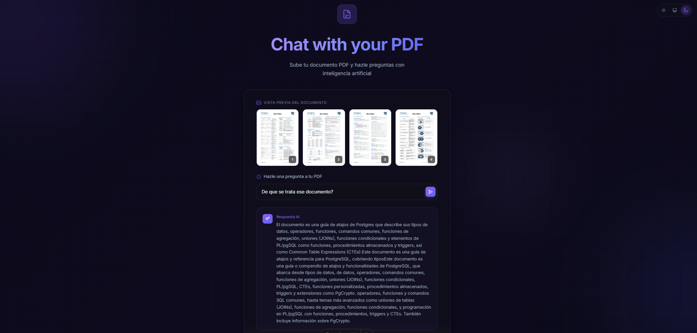

# Chat with your PDF

Aplicación web que permite subir un documento PDF y hacerle preguntas usando inteligencia artificial. El texto del PDF se extrae automáticamente mediante OCR y se utiliza como contexto para responder preguntas con Gemini.



## Tech Stack

- **Astro** — Framework web con SSR (Node adapter)
- **Svelte 5** — Componentes interactivos
- **Tailwind CSS + Flowbite** — Estilos
- **Cloudinary** — Almacenamiento de PDFs y OCR (`adv_ocr`)
- **Google Gemini** — Modelo de IA para responder preguntas (streaming via SSE)
- **TypeScript**

## Requisitos previos

- Node.js 18+
- pnpm
- Cuenta en [Cloudinary](https://cloudinary.com) con el add-on **OCR Text Detection and Extraction** activado
- API Key de [Google AI Studio](https://aistudio.google.com/apikey) (Gemini)

## Instalación

```bash
pnpm install
```

## Configuración

Copia el archivo de ejemplo y completa tus credenciales:

```bash
cp .env.example .env
```

```env
CLOUDINARY_SECRET="tu_api_secret"

# Configuración IA (por defecto Gemini)
AI_PROVIDER="gemini"
AI_MODEL="gemini-2.5-flash"
GEMINI_KEY="tu_api_key_de_google_ai_studio"

# Solo si usas NVIDIA NIM (API OpenAI-compatible)
NVIDIA_API_KEY="tu_api_key_de_nvidia"
NVIDIA_BASE_URL="https://integrate.api.nvidia.com/v1"
```

### Cambiar proveedor o modelo

- Usa `AI_PROVIDER="gemini"` para Google Gemini.
- Usa `AI_PROVIDER="nvidia"` para NVIDIA NIM.
- Cambia `AI_MODEL` por el nombre del modelo que quieras usar (por ejemplo `gemini-2.5-flash` o `z-ai/glm-4.7`).

## Desarrollo

```bash
pnpm dev
```

## Build

```bash
pnpm build
pnpm preview
```

## Cómo funciona

1. **Subir PDF** — El usuario arrastra o selecciona un archivo PDF
2. **Extracción de texto** — Cloudinary almacena el PDF y extrae el texto con OCR
3. **Chat** — El usuario hace preguntas y Gemini responde en streaming usando el texto extraído como contexto
